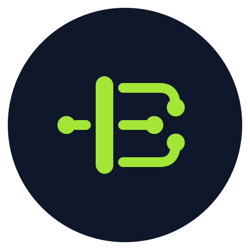

<p align="center">
  
</p>

<h1 align="center">Busbar</h1>

<p align="center"><strong>The reliability layer for LLM traffic.</strong> One endpoint speaks every major SDK; fault-aware circuit breaking and in-flight failover keep your app serving when your providers aren't.</p>

[](https://github.com/MattJackson/busbarAI/actions/workflows/ci.yml)
[](https://github.com/MattJackson/busbarAI/releases)
[](LICENSE)


📖 **Docs:** [getbusbar.com](https://getbusbar.com)  
⚡ **Install:** `curl -fsSL https://getbusbar.com/install.sh | sh`  
🐳 **Docker:** [`getbusbar/busbar`](https://hub.docker.com/r/getbusbar/busbar) — `FROM scratch`, ~5 MB, multi-arch, cosign-signed  
🤖 **Agent-readable:** [getbusbar.com/llms.txt](https://getbusbar.com/llms.txt)

Busbar sits between your application and your LLM providers. Point any SDK at one URL (OpenAI, Anthropic, Gemini, Bedrock, Cohere, or the Responses API) and Busbar routes it to the backends you chose, translating between protocols where they differ. When a provider fails, it keeps serving. That's why this isn't another proxy with a long model list.

> You define a model name and the backends behind it. Any client, speaking any of the six protocols, can reach that name. Which provider actually serves it is your config, not their code.

- **Lossless translation, both ways.** Nothing is flattened to OpenAI shape, so Anthropic thinking blocks, structured-output schemas, and Bedrock tool use survive the hop. Keep the SDK your code already speaks and swap providers with a config edit.
- **Failover inside the request.** If a lane fails before the first byte reaches your client (even on a streaming request), Busbar reroutes to the next backend in the pool. Your user never sees the 500.
- Every provider connection gets a circuit breaker that knows whose fault a failure was. A provider outage, a bad client request, a context overflow, and a revoked key are four different problems, and each gets different treatment instead of a blind retry.
- The request path is programmable. Routing is the first hook: pick a built-in policy (`weighted`, `cheapest`, `fastest`, `least_busy`, `usage`) or bring your own as a webhook in any language, or as a sandboxed Rhai script. A slow or broken hook falls back; it never blocks a request.
- TLS termination is native and mTLS is one config key. A client without a certificate signed by your CA is rejected at the handshake, before any token check even runs. Zero trust without a service mesh.

The whole thing is one static Rust binary (Linux and macOS on Intel and ARM, Windows on Intel). No Python sidecar, no interpreter, no GC in the request path. Your keys stay in your infrastructure.

> **Status: 1.1.0, stable.** The HTTP API, the configuration schema, and the six wire-protocol contracts are frozen under Semantic Versioning. Every release ships a CycloneDX SBOM and a build-provenance attestation, and the code has been through multiple rounds of security and correctness review. AGPL-3.0.

---

## The one-line change

Your code already speaks OpenAI (or Anthropic, or Gemini). Swap the base URL:

```diff
- client = OpenAI(api_key=OPENAI_KEY)
+ client = OpenAI(api_key=BUSBAR_TOKEN, base_url="http://busbar:8080")

  # `model` now names a single model OR a pool you define in config
  # (e.g. "fast" = 80% Claude / 20% GPT-4o, Gemini on failover)
  client.chat.completions.create(model="fast", messages=[...])
```

That request left your app as OpenAI. It may have been served by Anthropic, and it came back as OpenAI, translated in both directions. If Anthropic had returned a 429 before the first byte, Busbar would have moved on to the next pool member without your client noticing. The model name is a config value, not a code dependency.

---

## What's inside

- **Six wire protocols**, lossless in both directions; any client protocol reaches any pool → [Protocols](https://getbusbar.com/protocols/)
- **Fault-attributed circuit breaking** and streaming-safe in-flight failover → [Reliability](https://getbusbar.com/reliability/)
- **Weighted pools** with smooth weighted round-robin, session affinity, and per-lane concurrency caps → [Reliability](https://getbusbar.com/reliability/)
- **Routing policies.** Five built-ins, or your own logic as a webhook or Rhai script. A policy sees each member's cost, latency, live concurrency, budget, and rate headroom, and a failing policy falls back instead of blocking → [Routing](https://getbusbar.com/routing/)
- **Native TLS and optional mTLS**, terminated by Busbar itself, with no reverse proxy in front → [Security](https://getbusbar.com/security/)
- **Governance** when you want it: virtual keys, budgets, RPM/TPM limits, spend tracking → [Governance](https://getbusbar.com/guides/governance/)
- **A verified provider catalog**, plus any provider on the six protocols in a few lines of YAML → [Providers](https://getbusbar.com/providers/)
- **Hardening throughout**: SSRF guards, constant-time auth, SHA-256 key storage, secrets never logged → [SECURITY.md](SECURITY.md)
- **Observability** over open standards: Prometheus `/metrics`, OTLP traces, a per-request audit webhook → [Configuration](https://getbusbar.com/configuration/)

Busbar shares an arena with LiteLLM and OpenRouter, but it was built reliability-first, and the differences are bigger than a feature list. The honest comparison lives at **[Why Busbar](https://getbusbar.com/why-busbar/)**.

---

## Quickstart

```bash
curl -fsSL https://getbusbar.com/install.sh | sh        # busbar + providers.yaml into ./
```

A minimal `config.yaml`. Keys come from environment variables; the config names the variable and never holds the key:

```yaml
providers:
  anthropic: { api_key_env: ANTHROPIC_KEY }          # the NAME of the env var, not the key
models:
  claude: { provider: anthropic, max_concurrent: 10 }
pools:
  fast: { members: [ { target: claude, weight: 1 } ] }
```

```bash
export ANTHROPIC_KEY=sk-ant-...
BUSBAR_PROVIDERS=./providers.yaml BUSBAR_CONFIG=./config.yaml ./busbar
curl -s localhost:8080/v1/chat/completions -H 'content-type: application/json' \
  -d '{"model":"fast","messages":[{"role":"user","content":"Hello!"}]}'
```

Full walkthrough → **[Getting Started](https://getbusbar.com/getting-started/)**

---

## Docs & license

Full documentation is at **[getbusbar.com](https://getbusbar.com)** (agent-readable at [llms.txt](https://getbusbar.com/llms.txt)). Contributor docs (architecture, internals, ADRs) live in [`docs/`](docs/).

Single Rust binary, MSRV 1.87. Contributions welcome ([CONTRIBUTING.md](CONTRIBUTING.md)). Licensed **AGPL-3.0-or-later** ([LICENSE](LICENSE)); Busbar runs as a network service, so the AGPL's network-use clause (§13) applies.
